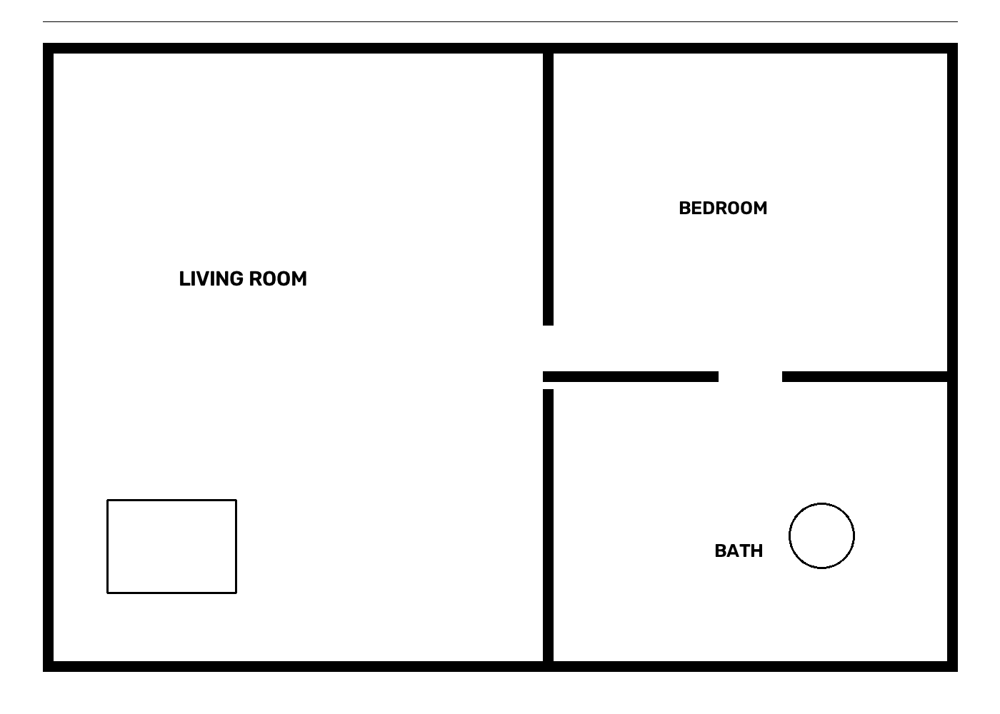

# Architect SaaS — 2D Floor Plan → 3D BIM Reconstruction

Converts architectural floor plan images into BIM-ready 3D models. This
repository contains a **working end-to-end vertical slice** of the platform
blueprint: upload → preprocessing → structure detection → vectorization →
room graph → classification → 3D reconstruction → validation → GLB export,
with a FastAPI backend and a Next.js + React Three Fiber viewer.



## Quick start

```bash
# Backend (Python 3.12+)
cd backend
python3 -m venv .venv && .venv/bin/pip install -r requirements.txt
.venv/bin/python -m pytest tests        # 12 tests, all green
.venv/bin/python -m uvicorn app.main:app --port 8000

# Frontend
cd frontend
npm install && npm run dev              # http://localhost:3000

# Or everything at once
docker compose up --build
```

Try it: drop `samples/sample_plan.png` onto the page, or generate a fresh one
with `python -m app.devtools.sample_plan`.

## API

| Method | Path | Description |
|---|---|---|
| POST | `/api/v1/plans` | Upload a PNG/JPEG plan (multipart `file`; optional `?meters_per_px=`, `?furniture=detected\|generated\|none`). Returns `202 {job_id}`. |
| GET | `/api/v1/jobs/{id}` | Job status, rooms (with label confidence), adjacency graph, detected openings, scene graph, validation + warnings, furniture report, room schedule, material take-off, cost estimate. |
| GET | `/api/v1/jobs/{id}/analysis.json` | Stage 1 artifact: detection-only analysis (walls, rooms, doors, symbols, scale) — no geometry, undetected classes marked pending, never guessed. |
| GET | `/api/v1/jobs/{id}/rooms.json` | Stage 2 artifact: per-room polygon, center, name, area, doors, windows (pending), adjacency, confidence + evidence trail. |
| GET | `/api/v1/jobs/{id}/graph.json` | Stage 3 artifact: semantic building graph — rooms as nodes, doors as typed edges, zones (public/private/service/circulation), hierarchy, accessibility from entrance. |
| GET | `/api/v1/jobs/{id}/geometry.json` | Stage 4 artifact: generated element counts (walls, slab, roof, parapet, lintels, door frames, skirting), standards used, pending classes (windows/stairs). |
| GET | `/api/v1/jobs/{id}/scene.json` | Stage 5+7 artifact: furnishing + decor scene per room — items with source (detected/generated), decor flag, placement rules. |
| GET | `/api/v1/jobs/{id}/materials.json` | Stage 6 artifact: PBR metallic-roughness materials with per-node assignments; texture maps declared pending. |
| GET | `/api/v1/jobs/{id}/lighting.json` | Stage 8 artifact: lights embedded in the GLB (KHR_lights_punctual) + renderer recommendations (HDRI, exposure, shadows, AO). |
| GET | `/api/v1/jobs/{id}/model.{fmt}` | The reconstructed 3D model — `glb`, `obj`, `stl`, or `ply`. |
| GET | `/health` | Liveness probe (public, unauthenticated). |

Geometry follows architectural standards: 230 mm exterior walls (scale
reference), 3000 mm floor-to-ceiling height, 150 mm floor and roof slabs. The
roof is exported as separately named geometry so viewers can toggle it.

## Architecture

```
backend/app/pipeline/        one module per stage, typed contracts between them
  preprocess.py   decode + binarize (pixel caps against decompression bombs)
  detect.py       wall extraction  ← ML plug-in point (YOLO/RT-DETR/SAM2)
  vectorize.py    masks → Shapely polygons; room segmentation
  graph.py        room-connectivity graph (doors = openings)
  building_graph.py  semantic graph: zones, hierarchy, accessibility,
                  circulation depth from entrance
  classify.py     evidence-based room classifier (size/adjacency/door rules,
                  per-room confidence)  ← ML plug-in point (GraphSAGE/GCN)
  ocr.py          text/scale       ← ML plug-in point (PaddleOCR/TrOCR)
  openings.py     doors/passages from wall gaps: width, connected rooms
  symbols.py      furniture symbols from the drawing, reconstructed at their
                  exact drawn footprint — fidelity mode, the default
  furniture.py    catalog placement: wall alignment, collision detection,
                  per-item clearance, door-clearance zones, stacked pieces
                  (mattress/blanket), elevated pieces (upper cabinets, mirrors).
                  furniture=auto (default): drawn symbols keep their exact
                  position; symbol-less rooms are furnished — no empty rooms
  reconstruct.py  2D → 3D (Trimesh): walls, slab, roof + parapet, door
                  lintels/frames at detected openings, skirting, furniture
  materials.py    PBR metallic-roughness materials chosen from what each
                  element is (paint, marble/wood/ceramic floors, granite,
                  mirror, glass, emissive LED); texture maps pending
  lighting.py     per-room punctual lights + sun, injected into the GLB as
                  KHR_lights_punctual (viewers load the model already lit)
  reports.py      room schedule, material take-off, indicative cost estimate
  validate.py     mesh integrity, scale plausibility, room reachability
  runner.py       orchestrator — pure function, Celery-ready
```

Each stage consumes and returns the dataclasses in `pipeline/types.py`, so the
classical-CV MVP detectors can be swapped for trained models without touching
the orchestration, API, or frontend.

## Security posture

- **Uploads**: magic-byte sniffing (not client MIME), hard size cap (20 MB),
  pixel-count cap (40 MP) against decompression bombs.
- **Filesystem**: artifact paths are built only from server-generated UUIDs;
  no user-controlled value ever reaches a path.
- **API**: optional key auth (`ARCH_API_KEY`, constant-time compare), per-IP
  token-bucket rate limiting, hardening headers, CORS locked to the frontend
  origin, GET/POST only.
- **Errors**: internal failures log the traceback server-side and return a
  generic message — no stack traces or paths leak to clients.
- **Containers**: both images run as unprivileged users; backend data on a
  dedicated volume.

Production additions to make before exposure to the internet: TLS termination,
real identity (OIDC) + per-tenant quotas instead of a shared API key, object
storage (MinIO/R2) for artifacts, and Postgres instead of the SQLite job store
(the store is isolated behind `app/store.py` for exactly this swap).

## Roadmap (from the platform blueprint)

| Module | Status | Where it plugs in |
|---|---|---|
| Wall/room extraction (classical CV) | ✅ working | `detect.py`, `vectorize.py` |
| Room connectivity graph | ✅ working | `graph.py` |
| 3D reconstruction + GLB export | ✅ working | `reconstruct.py` |
| Validation suite | ✅ working | `validate.py` |
| Web viewer (R3F) | ✅ working | `frontend/` |
| Furniture symbol detection (fidelity mode, default) | ✅ working | `symbols.py` |
| Openings (doors/passages) with widths + room links | ✅ working | `openings.py` |
| Scene graph + validation warnings/confidences | ✅ working | `runner.py` |
| Furniture AI, opt-in generated mode | ✅ working | `furniture.py` |
| Roof/ceiling generation (toggleable) | ✅ working | `reconstruct.py` |
| Multi-format export (GLB/OBJ/STL/PLY) | ✅ working | `api/routes.py` |
| Room schedule, material take-off, cost estimate | ✅ working | `reports.py` |
| Doors/windows/stairs detectors (YOLO/SAM2) | ⬜ | `detect.py` contract |
| OCR: room names, dimensions, scale | ⬜ | `ocr.py` contract |
| GNN room classifier | ⬜ | `classify.py` contract |
| IFC / USD / FBX / STEP export | ⬜ | `reconstruct.py` (IfcOpenShell/OpenCascade) |
| PBR materials, style presets, lighting | ⬜ | new stage after `reconstruct` |
| Photorealistic renders + walkthrough video | ⬜ | headless Blender stage |
| Celery + RabbitMQ workers | ⬜ | `runner.py` is already a pure function |
